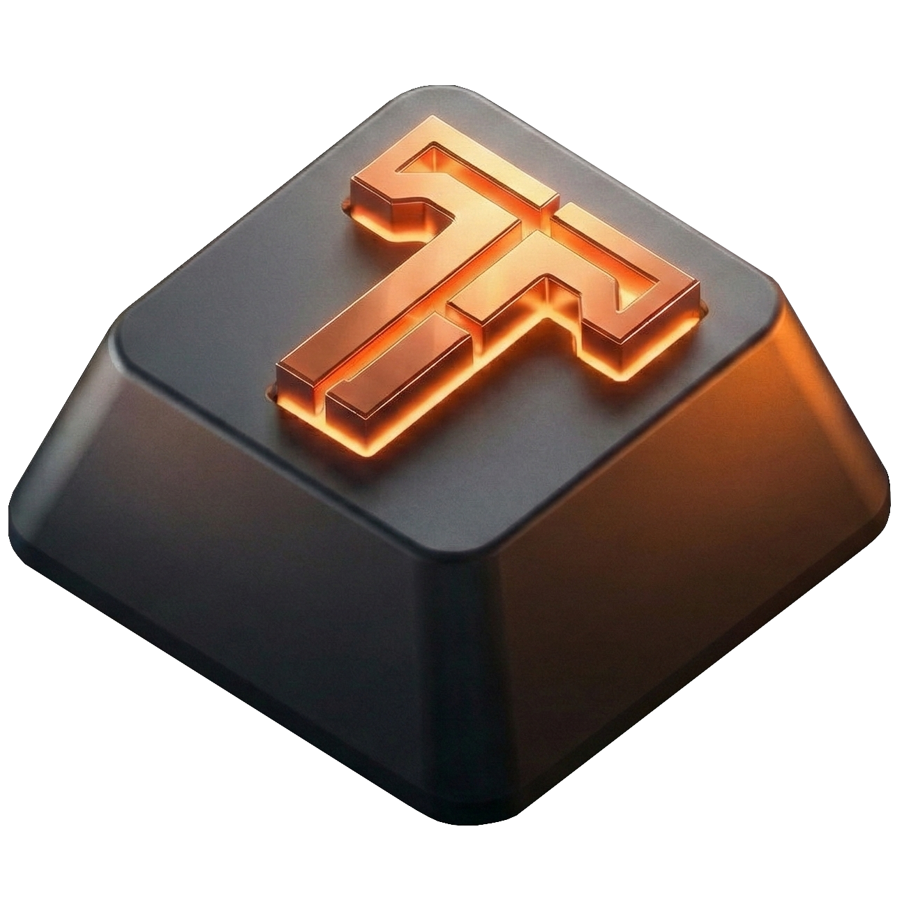

# ⚡ Talos 7
### The Ultimate Open-Source SudoPad 

<div align="center">
  
  <br/>
  
  [](https://github.com/szymonwilczek/talos-7/actions)
  [](https://github.com/szymonwilczek/talos-7/releases)
  
  

  <p>
    <b>Professional. Driverless. Infinite Possibilities.</b><br/>
    Designed for Streamers, Developers, and Creatives. <br/>
    Forged to automate.
  </p>
</div>

---

## 📖 Overview

**Talos 7** is not just a keypad; it's a hardware productivity platform. I've name this functionality as SudoPad. Unlike traditional macro pads that rely on heavy background software (like Synapse or iCUE), **Talos 7 runs everything on the device itself**.

Once configured via the web interface, you can plug it into **any computer** (Windows, macOS, Linux, iPadOS), and it will work instantly. No drivers. No background agents. Just pure hardware emulation.

### Why Talos?
* **Hybrid Device:** Simultaneously acts as a Keyboard, Mouse, MIDI Controller, and Serial Device.
* **OLED Dashboard:** A 128x64 pixel display gives you real-time feedback on layers and actions.
* **Web Configurator:** Modify your layout directly in Chrome/Edge using Web Serial API.
* **Hephaestus CI/CD:** Automated cloud builds ensure you always have the latest firmware.

---

## 🛠️ Hardware Architecture

Talos 7 is built on the accessible and powerful **Raspberry Pi Pico (RP2040)**.

### Bill of Materials (BOM)
* 1x **Raspberry Pi Pico** (or Pico W)
* 7x **Mechanical Switches** (Cherry MX Red / I switch them sometimes to Akko Black)
* 7x **Keycaps** (I've been using Keychron Keycaps)
* 1x **SSD1306 OLED Display** (1.3" or 0.96", SPI Interface)
* 7x **LEDs** (3mm or 5mm) + Resistors (220Ω)
* 1x **Micro-USB Data Cable** (for Pico)

### Wiring Diagram (Pinout)

| Component | Function | Pico Pin (GPIO) | Physical Pin |
| :--- | :--- | :--- | :--- |
| **Switch 1** | Input (Pull-UP) | **GP2** | 4 |
| **Switch 2** | Input (Pull-UP) | **GP3** | 5 |
| **Switch 3** | Input (Pull-UP) | **GP4** | 6 |
| **Switch 4** | Input (Pull-UP) | **GP5** | 7 |
| **Switch 5** | Input (Pull-UP) | **GP6** | 9 |
| **Switch 6** | Input (Pull-UP) | **GP7** | 10 |
| **Switch 7** | Input (Pull-UP) | **GP8** | 11 |
| **OLED MOSI** | SPI TX | **GP19** | 25 |
| **OLED SCK** | SPI SCK | **GP18** | 24 |
| **OLED CS** | Chip Select | **GP17** | 22 |
| **OLED DC** | Data/Command | **GP16** | 21 |
| **OLED RST** | Reset | **GP15** | 20 |
| **LEDs 1-7** | Backlight | GP20, 21, 22, 26, 27, 28, 0 | Various |

---

## 🚀 Setup & Installation

### 1. Flash the Firmware
You don't need to compile anything manually.
1.  Go to [**Releases**](https://github.com/szymonwilczek/talos-7/releases).
2.  Download the latest `talos7.uf2`.
3.  Hold the **BOOTSEL** button on your Pico while plugging it into USB.
4.  A drive named `RPI-RP2` will appear. Drag and drop the `.uf2` file there.
5.  The device will reboot. You should see the Talos Logo on the OLED.

### 2. Configure via Web
1.  Open the **[Talos Configurator](https://your-url-here.com)** in a Chromium-based browser (Chrome, Edge, Opera).
2.  Click **Connect Device** and select *Talos 7*.
3.  **Customize** your layers and buttons.
4.  Click **Save Changes** to flash your config to the onboard memory.

---

## 🎛️ Macro Dictionary

Talos 7 supports **8 distinct action types** (for now, if you have something in mind, be welcome to propose). Here is a deep dive into each capabilities.

### 1. ⌨️ Key Press
Simulates a standard keyboard press.
* **Parameters:** Keycode (A-Z, F1-F12, etc.).
* **Use Case:** Muting Discord (`F13`), Screenshot (`PrintScreen`), Game abilities (`Q`, `W`, `E`).

### 2. ⛓️ Key Sequence
Executes a precise combination of up to 3 keys pressed simultaneously or sequentially.
* **Parameters:** List of keys + Modifiers (Ctrl, Alt, Shift, GUI).
* **Use Case:** `Ctrl` + `Shift` + `Esc` (Task Manager), `Win` + `Shift` + `S` (Snipping Tool).

### 3. 🔡 Text String
Types a text snippet automatically.
* **Parameters:** Text content (up to 32 chars).
* **Behavior:** Works like a super-fast typist. Supports basic Unicode.
* **Use Case:** Email signatures, Git commands (`git push origin main`), etc.

### 4. 🔄 Layer Toggle
Switches the active layer of the device.
* **Parameters:** Target Layer (Automatic Cycle).
* **Behavior:** Pressing this creates a loop: `Layer 1` → `Layer 2` → `Layer 3` → `Layer 4` → `Layer 1`.
* **Visuals:** The OLED instantly updates to show the new layer's name and icon.

### 5. 🖱️ Mouse Control
Takes hardware control of the mouse cursor.
* **Sub-types:**
    * **Move:** X/Y coordinates (relative). Great for AFK scripts.
    * **Click:** Left, Right, or Middle button (with Hold support).
    * **Wheel:** Scroll Up/Down.
* **Use Case:** "Cookie Clicker" macros, in-game AFK preventions, preventing screen lock.

### 6. 📜 Script Engine (Power User)
The most powerful feature. Talos acts as a "BadUSB" device to inject and execute complex scripts on the host machine.
* **Platform Awareness:** You can define separate scripts for Windows, Linux, and macOS on the same button.
* **Workflow:**
    1.  Talos opens a terminal using a shortcut (e.g., `Win+R` or `Ctrl+Alt+T` - those are just default, you can provide your own sequence if you have it).
    2.  It types a temporary script file to `/tmp` or `%TEMP%`.
    3.  It executes the file and deletes it immediately.
* **Use Case:** `docker-compose up -d`, SSH into a server, batch rename files, organize desktop.

### 7. 🎹 MIDI Note (Studio Mode)
Sends a MIDI Note On/Off signal via USB MIDI class.
* **Parameters:** Note (0-127), Velocity (0-127), Channel (1-16).
* **Why MIDI?** Unlike keyboard shortcuts, MIDI messages **never conflict** with typing and work even when the target app is in the background.
* **Integration:**
    * **OBS:** Use `obs-midi` plugin to switch scenes or toggle sources.
    * **DAWs:** Map to drum pads in FL Studio / Ableton.

### 8. 🎚️ MIDI Control Change (CC)
Sends a generic MIDI value (Potentiometer/Fader simulation).
* **Parameters:** CC Number (0-119), Value (0-127), Channel (1-16).
* **Use Case:**
    * **Lightroom:** Set Exposure to +1.0.
    * **Premiere Pro:** Set Timeline Zoom level.
    * **Windows Volume:** Use middleware (e.g., MidiKey2Key) to map CC to system volume.

---

## 🤖 DevOps: Hephaestus

This repository is managed by an automated github workflow named **Hephaestus**.

### Automated Versioning
I use **Semantic Versioning**. Hephaestus parses every commit message:
* `fix: ...` ➜ Bumps **Patch** (1.0.0 ➜ 1.0.1)
* `feat: ...` ➜ Bumps **Minor** (1.0.1 ➜ 1.1.0)
* `feat!: ...` ➜ Bumps **Major** (1.1.0 ➜ 2.0.0)

### Continuous Delivery
On every valid push to `main`:
1.  Hephaestus spins up a cloud environment with the **ARM GCC Toolchain**.
2.  It checks out the official **Pico SDK**.
3.  It compiles the firmware (`talos7.uf2`).
4.  It creates a **GitHub Release** with the new version and changelog.

---

## 🔧 Troubleshooting

### Device not connecting in browser?
* **Windows:** Ensure you are not blocking USB devices via Group Policy. No drivers needed.
* **Linux:** You might need udev rules. Run:
    ```bash
    echo 'SUBSYSTEM=="tty", ATTRS{idVendor}=="2e8a", ATTRS{idProduct}=="000a", MODE="0666"' | sudo tee /etc/udev/rules.d/99-pico.rules
    sudo udevadm control --reload-rules
    ```
* **Browser:** Use Chrome, Edge, or Opera. Firefox/Safari do not support Web Serial yet.

### Firmware update failed?
If you "bricked" the configuration or the device is unresponsive:
1.  Unplug the device.
2.  Hold the physical **BOOTSEL** button on the Pico.
3.  Plug it in.
4.  Flash the `.uf2` again. This factory resets the core logic.

---

## 📄 License & Credits

* **Core Logic:** Szymon Wilczek
* **Project Link:** [github.com/szymonwilczek/talos-7](https://github.com/szymonwilczek/talos-7)
* **License:** [MIT License](./LICENSE.md) 

Built with ❤️ using **Raspberry Pi Pico SDK** and **TinyUSB**.
